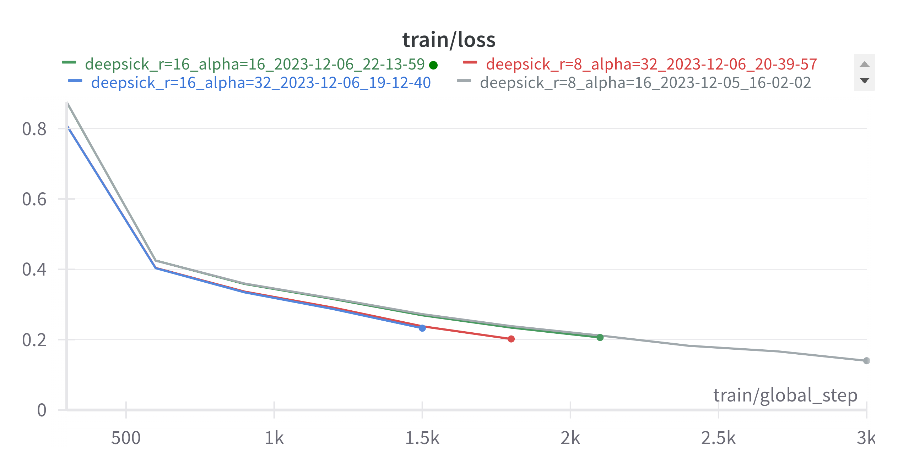
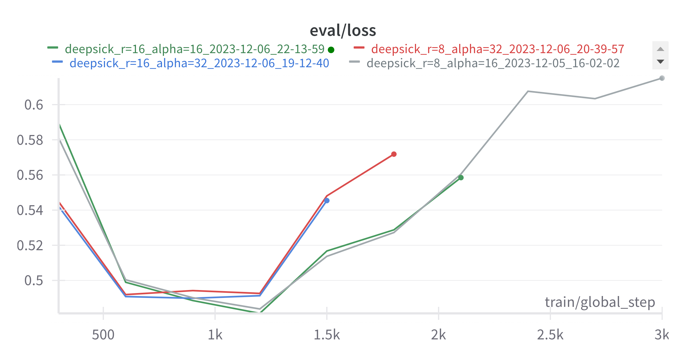

# LLM for calling API

## Введение и обзор решений

Задача задания заключалась в создании языковой модели, которая может вызывать сторонний API для заказа билетов на самолет.
Такая модель должна уметь как поддерживать обычный диалог, так и при запросе пользователя закать билет/выдать информацию о рейсе вызывать сторонний API для этого.

В общем смысле, такая задача сводится к обучению модели делать запросы к функциям, к которым она имеет доступ - т.е. к задаче **Function Calling**. При необходимости, модель должна идентицировать необходимость вызова функции и выдавать структурированный json-ответ с названием функции и передаваемыми аргументами, с помощью которого эту функцию можно вызвать. Таким образом, можно переводить запрос на естественном языке к API какого-то сервиса, делать запрос к базе данных или просто получать структурированный ответ для последующей обработки.
Такая возможность, например, [внедрена в модели gpt-4-0613 and gpt-3.5-turbo-0613 от OpenAI](https://openai.com/blog/function-calling-and-other-api-updates).

Если говорить об открытых моделях, то именно этому посвящена, например, модель [Functionary](https://github.com/MeetKai/functionary), разные версии которой дообучали на chat-instruct датасете [ShareGPT34K](https://huggingface.co/datasets/ehartford/wizard_vicuna_70k_unfiltered) и их собственном закрытом синтетическом датасете function calling. 

Другие модели, заточенные под эту задачу это модели от [GlaiveAI](https://huggingface.co/glaiveai). Этот же проект содержит открытые данные для дообучения такого рода моделей - [glaive-function-calling-v2 dataset](https://huggingface.co/datasets/glaiveai/glaive-function-calling-v2). Каждое наблюдение содержит system prompt, описывающий доступные для модели функции, а так же небольшой диалог между пользователем и моделью, во время которого модель может вызывать доступную функцию при необходимости. Этот датасет показался мне крайне полезным для дообучения моей модели, его я еще опишу подробнее ниже.

Еще примеры открытых моделей - [rizerphe/CodeLlama-function-calling-6320-7b-Instruct-hf](https://huggingface.co/rizerphe/CodeLlama-function-calling-6320-7b-Instruct-hf) и [Trelis/Llama-2-7b-chat-hf-function-calling-v2](https://huggingface.co/Trelis/Llama-2-7b-chat-hf-function-calling-v2). Первая дообучалась на части уже упомнянутого мною **glaive-function-calling-v2 dataset** и части [ShareGPT](https://huggingface.co/datasets/totally-not-an-llm/sharegpt-hyperfiltered-3k).

Если смотреть на задачу как на еще более общую, то она заключается в дообучении модели с помощью Instruction-tuning - процессе дообучения LLM на датасете, состоящем из пар (INSTRUCTION, OUTPUT) с помощью supervised-обучения. Таким образом, устраняя разрыв между целью LLM по предсказанию следующего слова и целью пользователей, заключающейся в том, чтобы LLM соответствовали человеческим инструкциям ([Instruction Tuning for Large Language Models: A Survey](https://arxiv.org/pdf/2308.10792.pdf)). 
Существует множество моделей, обучавшихся на различных Instruct датасетах и можно предпололжить, что при соответствующем формировании промта с описанием возможных функций и примеров вызова. 


## Постановка задачи

Для упрощения, функция покупки билета была приведена к получении информации о полете по следующим параметрам:

+ city_from: Город отправления
+ city_to: Город прилета
+ date: Дата отправления
+ date_back: Дата обратного билета
+ need_luggage: Нужен ли багаж

Таким образом, была поставлена цель дообучить модель, которая бы могла при запросе покупки билета/получении информации о полете или билете вызвать некую функцию **get_flight_info** с указанными параметрами. Вызов функции должен сопровождаться неким обозначением вызова (у меня это "\<functioncall\>", как в датасете glaive) и передачей названия функции и ее параметров в структурированном виде (в json формате).


## Данные

### Данные для дообучения

В качестве данных для дообучения модели был выбран уже упомянутый [glaive-function-calling-v2 dataset](https://huggingface.co/datasets/glaiveai/glaive-function-calling-v2).
Он был выбран по следующим причинам:
+ Он содержит в себе примеры function calling для совершенно разных функций, определенных в system prompt для модели. Это поможет модели научиться идентифицировать необходимость вызова функции и определения параметров, а также генерации ответа по ответу от функции.

Пример данных с function calling из датасета:

```
SYSTEM: You are a helpful assistant with access to the following functions. Use them if required -
{
"name": "generate_password",
"description": "Generate a random password",
"parameters": {
"type": "object",
"properties": {
"length": {
"type": "integer",
"description": "The length of the password"
},
"include_symbols": {
"type": "boolean",
"description": "Whether to include symbols in the password"
}
},
"required": [
"length"
]
}
}

{
"name": "create_task",
"description": "Create a new task in a task management system",
...
"priority"
]
}


USER: I need a new password. Can you generate one for me?

ASSISTANT: Of course. How long would you like your password to be? And would you like it to include symbols?

USER: I would like it to be 12 characters long and yes, please include symbols.

ASSISTANT: <functioncall> {"name": "generate_password", "arguments": \'{"length": 12, "include_symbols": true}\'}'

FUNCTION: {"password": "4&7j#9@1Q6*"}

ASSISTANT: Here is your new password: 4&7j#9@1Q6*. Please make sure to save it in a secure location.
```

+ Это chat-data, а не одна пара Instruction-Output. Это важно, так как задача заключается в создании модели, которая может вести диалог, а не переводить один запрос в функцию.
+ Данные содержат и примеры, где модели необходимо ответить на вопрос без вызова функции, то есть дообучение на таком датасета не должно привести к полной подгонке под генерация вызовов функций - модель должна уметь поддерживать диалог, отвечать на отвлеченные вопросы, и не вызывать функцию там, где не нужно.

Пример диалога из датасета без вызова функции:

```
SYSTEM: You are a helpful assistant with access to the following functions. 
Use them if required -
{
"name": "get_exchange_rate",
"description": "Get the exchange rate between two currencies",
"parameters": {
"type": "object",
"properties": {
"base_currency": {
"type": "string",
"description": "The currency to convert from"
},
"target_currency": {
"type": "string",
"description": "The currency to convert to"
}
},
"required": [
"base_currency",
"target_currency"
]
}
}

USER: Can you book a flight for me from New York to London?

ASSISTANT: I'm sorry, but I don't have the capability to book flights.
```


Для дообучения из датасета было случайно выбрано 700 диалогов с запросами к функции и 300 без запросов.


### Данные для оценки

Для того, что оценить, насколько хорошо модель определяет необходимость вызова функции покупки билета и определения параметров, я сгенерировала новые данные.

Данные содержат в себе общие вопросы, на которые модель должна просто ответить, не вызывая функции, а так же вопросы, подразумевающие вызов функции.

**Примеры общих вопросов:**

1. What is the role of pilots in ensuring safe flights for passengers?
2. How do pilots navigate through turbulent weather conditions during flights?
3. What are the specific benefits of a vegan diet, and how can someone transition to this lifestyle?

**Пример данных с необходимостью запроса к функции:**

1. I would like to purchase a round-trip air ticket from Moscow to Novosibirsk on September 20, 2022, and return to Moscow on December 15, 2022. Please provide me with available options and prices for this travel dates.

Правильные аргументы функции:
```
{
    "city_from": "Moscow", 
    "city_to": "Novosibirsk", 
    "date": "09.20.2022", 
    "date_back": "12.15.2022", 
    "need_luggage": null
}
```

#### Процесс создания датасета

1. Сгенерированы 720 разных комбинаций строк с разными городами отправления и прибытия, рандомными датами и необходимости багажа.
Добавлены строки с полностью заполненными параметрами, а также частично пропущенными.

Используемые города: "Moscow", "Novosibirsk", "Saint-Petersburg" "Yekaterinburg".

2. Для каждой такой строки с помощью моделей [Zephyr-7b-beta](https://huggingface.co/TheBloke/zephyr-7B-beta-GGUF) и [Llama-7b-chat](https://huggingface.co/TheBloke/Llama-2-7B-Chat-GGUF) сгенерированы вопросы.

Были использованы модели, сконвертированные в gguf и квантизированные Q4_K_M методом. Весь инференс выполнялся в помощью библиотеки [llama-python-cpp](https://github.com/abetlen/llama-cpp-python).

Предварительно скачаны модели в gguf-формате отсюда:
[zephyr-7b-beta.Q4_K_M.gguf](https://huggingface.co/TheBloke/zephyr-7B-beta-GGUF) и [llama-2-7b-chat.Q4_K_M.gguf](https://huggingface.co/TheBloke/Llama-2-7B-Chat-GGUF).


Пример промта для всех заполненных параметров:

```
Q: Generate a request or desire to buy a plane ticket from {city_from} to {city_to} on {date_str} with a return ticket on {date_back} {with luggage|without luggage}
```

При отсутствии какого-то параметра в строке, он просто не вставлялся в запрос. 

3. Сгенерированы общие вопросы (на которые не нужно делать functioncall) с помощью запросов:

```
"Q: Generate one question on any topic. A:"
"Q: Generate one question on a topic of airplains and flights. A:"
```

Сгенерировано 100 вопросов с каждым промптом и затем отфильтрованы пустые ответы. 

4. Фильтрация и соединение датасета.

+ Часть вопросов для function-calling была вручную проверена и поправлена - всего было таким образом всего 69 строк (по 2 вопроса к каждой). Итого, в финальный датасет вошло 118 вопросов.
+ Из 200 сгенерированных общих вопросов не пустыми оказалось 113.


Распределения параметров в function-calling части датасета:

+ city_from

|value|counts|
|-----|-----|
|Moscow |          50|
|Yekaterinburg  |  46|
|Novosibirsk   |   22|

+ city_to

|value|counts|
|-----|-----|
|NaN       |          20|
|Saint-Petersburg  |  58|
|Novosibirsk      |   22|
|Moscow    |          18|

+ date

|value|counts|
|-----|-----|
|NaN         |  22|
|09.20.2022  |  20|
|11.17.2022  |  20|
|04.12.2020  |  20|
|11.28.2021  |  18|
|09.15.2021  |  18|

+ date_back

|value|counts|
|-----|-----|
|NaN       |    80|
|12.15.2022  |   8|
|01.23.2023   |  8|
|03.01.2023   |  8|
|03.06.2021  |   8|
|11.05.2022   |  6|

+ need_luggage

|value|counts|
|-----|-----|
|NaN    |  80|
|False  |  20|
|True   |  18|


**Ограничения датасета**

1. Датасет создан лишь для оценки вызова функции по одному запросу.

Это значит, что, если модель, например, что-то уточняла по запросу, то такой ответ засчитается как несрабатывание вызова функции.

2. Не оценивает качество ответов на отвлеченные вопросы, а также качество ответов по выводу функции.

3. Датасет, в целом, довольно однообразный и вопросы, сгенерированные моделями, довольно похожи. 

4. Function-calling часть была изначально спроектирована для того, чтобы проверить разные комбинации присутствия/отсутствия параметров с разными значениями и подразумевалось, что все 720 комбинаций параметров пойдут в оценку. Однако, после генерации вопросов моделями, я поняла, что, во-первых, вопросы нужно чистить иногда от мусора, а во-вторых, что самое важное, проверять сами вопросы, так как модели могут добавлять информацию от себя (например, добавляли даты, там где их не было). Таким образом, пришлось проверять вопросы вручную и поэтому датасет сильно сократился, и распределения значений параметров стали очень скошенными.


## Модель

Для обучения была выбрана модель [Deepseek-coder-instruct 1.3B](https://huggingface.co/deepseek-ai/deepseek-coder-1.3b-instruct) - дообученная на Instruction датасете базовая модель размером всего 1.3B.

Выбор пал на нее по следующим причинам:

+ Кодерная модель, кажется, должна быстрее выучиться выдавать структурированный ответ в json-формате (хотя данная гипотеза требует проверки)
+ Deepseek - модели [хорошо показывают себя на бенчмарках](https://github.com/deepseek-ai/DeepSeek-Code), в сравнении с другими кодерными моделями (хотя и лучше всего работают версии бОльших размеров).
+ Модель имеет довольно маленький размер, что очень подходит для меня в ситуации ограниченных ресурсов и использования Google Colab для обучения (так, например, модель 7B даже в квантизированном до 4 бит формате, сразу вызывала MemoryError при загрузке).

Модель обучалась на задачу next-token prediction на ответах assistant в датасете с функцией потерь кросс-энтропия.

Сэмплированные данные (1000 примеров) glaive датасета использовались для дообучения. Сообщения были поделены на train и validation в соотношении 0.8 и 0.2. 
Лучшая модель определялась на значении функции потерь на валидационном датасете.

Модель обучалась с помощью метода [QLoRA](https://arxiv.org/abs/2305.14314) - метода обучения квантизированных моделей с помощью метода Low Rank Adapters(LoRA). Дообучение проводилось на модели, квантизированной до 4 бит.

Было проведено несколько экспериментов, насколько позволило время и ресурсы Google Colab, а именно проведено 4 эксперимента с варьированием значений rank и alpha для метода LoRA:

+ rank=8, alpha=16
+ rank=8, alpha=32
+ rank=16, alpha=16
+ rank=16, alpha=32


Другие основные параметры обучения:

+ gradient_accumulation_steps = 4
+ BATCH_SIZE = 1
+ scheduler=linear_schedule_with_warmup
+ warmup_steps= 1 эпоха
+ learning_rate=2e-4
+ p16=True
+ optim="paged_adamw_8bit"

Обучение проводилось с помощью библиотеки transformers.


### Графики функции потерь для обучаюющего и валидационного датасетов






### Выбор итоговой модели

Выбор итоговой модели для дальнейшей оценки был сделан на основании наименьшего eval_loss - была выбрана модель с параметрами LoRA rank=16, alpha=16.

На графиках, на самом деле, видно, что значение rank в этих 4 экспериментах не особо изменяет результаты , в отличие от параметра alpha. Если бы позволяло время, я бы еще поэкспериментировала с этими и другими параметрами.


Модель выложена на HF hub [pestova/deepseek-coder-1.3b-function-calling-v1](https://huggingface.co/pestova/deepseek-coder-1.3b-function-calling-v1).

## Результаты

Далее будут представлены результаты тестирования модели на моем датасете.

Выбранная модель на eval_loss была объединена с обученным LoRA-адаптером, сконвертирована в gguf формат и затем получены ее ответы на все вопросы из моего тестового датасета. Модель не была квантизирована, использовалась версия с типом float16.  

Модели подавался следующий system prompt при каждом запросе (формат аналогичен промтам из glaive dataset).

```
system_prompt = """You are a helpful assistant with access to the following functions. Use them if required - 
    {
        "name": "get_flight_info",
        "description": "Get information about flight and plain tickets.",
        "parameters": {
            "type": "object",
            "properties": {
                "city_from": {
                    "type": "string",
                    "description": "Departure city"
                },
                "city_to": {
                    "type": "string",
                    "description": "Arrival city"
                },
                "date" : {
                    "type": "string",
                    "format": "date",
                    "description": "Date of Departure in MM-DD-YYYY format"
                },
                "date_back: {
                    "type": "string",
                    "format": "date",
                    "description": "Date of Arrival in MM-DD-YYYY format"
                },
                "need_luggage: {
                    "type": "boolean",
                    "description": "Whether a luggage is necessary, True or False (if information is provided in request)"
                },
            },
        "required": [
            "city_from",
            "city_to",
            "date",
            "date_back",
            "need_luggage"
        ]
    }
    """

```


### Идентификация Functioncall

Считалось, что модель сделала functioncall, если она начала свой ответ с строки "\<functioncall\>" (именно так обозначаются функции в датасете для предобучения).


| Accuracy    | Precision | Recall| 
| -------- | ------- | ------- |
| 0.94  | 0.91    | 0.97|


(Всего примеров с function call в датасете: 118)


### Парсинг json

Даже если модель идентифицировала functioncall, еще не факт, что в ее ответе содержится валидный json с названием функции и параметрами.

Поэтому следующее, что хотелось проверить, насколько хорошо парсится ответ модели в json-формате.

Ответ модели парсился с помощью библиотеки pyyaml - таким образом, дозволялись небольшие неточности в выводе.

В соответствии с датасетом для дообучения, мы ожидаем от модели functioncall в следующем формате:

```
<functioncall> {"name" : "get_flight_info", "arguments": {"city_from": xxx, "city_to": xxx, "date": xxx, "date_back": xxx, "need_luggage": xxx}}
```

Далее представлен процент удачно распознанного верхнего словаря (`{"name" : "get_flight_info", "arguments": xxx}`) и словаря arguments `{"city_from": xxx, "city_to": xxx, "date": xxx, "date_back": xxx, "need_luggage": xxx}`.

Удачно распознанный значит, что:
+ Не возникло ошибки при парсинге строки в словарь функцией yaml.safe_load.
+ Словарь arguments: ключ arguments есть в верхнем словаре, и его значение так же удачно парсится функцией yaml.safe_load.


|| Number of parsed| 
| -------- | ------- | 
|Main dict | 100 |
|Arguments dict | 96|
|Total function calls identified| 110 |


Стоит отметить, что в данном случае не учитывается, правильные ли параметры были определены моделью (в словаре содержатся правильные ключ и их значения).

Учитывается только получилось ли распарсить словарь впринципе.

### Arguments Identification

Теперь посмотрим на самое главное - на то, как модель справляется с определением аргументов.

Выберем true function calls - и по каждому из аргументов сравним, как получилось достать из данных нужную информацию.

Ниже приведена метрика accuracy определения значения аргумента.

|parameter| Accuracy|
| -------- | ------- |
|city_from | 0.72 |
|city_to |0.45 |
|need_luggage| 0.05 |
|date|0.22 |
|date_back| 0.08 |


Несмотря на то, что в промте был четко прописан формат даты - MM-DD-YYYY, я решила немного помочь модели и даты парсились последовательно по трем форматам - "%m-%d-%Y", "%m/%d/%Y", "%m.%d.%Y".


Если еще немного посмотреть на парсинг дат - можно посмотреть следующую статистику.

|parameter| #дат  | #дат, найденных моделью| #удачно распарсенных как даты | #совпавших c ground truth|
| -------- | ------- | -------- | ------- | ------- | 
|date | 96 | 76| 39| 21|
|date_back |38 | 4 |3 | 3|


Таким образом, видно, что
+ модель вообще плохо находит date_back. На самом деле, вместе с need_luggage, она просто не вставляет этот параметр в вызов функции (параметр need_luggage модель вставила лишь в 7 случаях, тогда как в оригинальных данных он отмечен в 38 вопросах). 
+ c date ситуация менее плачевная
+ даже при высоком проценте определия необходимости добавить параметр date в функцию, затем почти половина этих дат пропадает из-за несоответствия формату и затем кол-во правильно распознанных дат еще раз уменьшается вдвое при сравнении даты с ground truth date.


Проиллюстрировать проблему парсинга дат можно, показав несколько примеров дат, которые модель вставила в свой вызов функции:

```
parsed_date
11-28-2021                          8
12-04-2020                          6
09-15-2021                          4
11-17-2022                          3
09-20-2022                          3
09/15/2021                          2
09-20                               2
17-11-2022                          2
12-30                               2
12/04/2020                          2
2021-11-28                          2
09-15-2022                          2
20-Sep-20                           1
{'departure': 20, 'arrival': 31}    1
09-20-22                            1
20-09-2022                          1
09-17-2022                          1
20-Sep-2022                         1
```

Тут видно, что иногда даты совершенно не соответствуют необходимому формату. Возможно, дополнительные эксперименты с system_prompt могли бы немного улучшить ситуацию.


### Примеры чата с моделью

#### 1.
```
User (print 'exit' for stop): Hi! I want to buy tickets from Moscow to London

Assistant:  Sure, I can help with that. Let me find the information for you.

User (print 'exit' for stop): okey, please, give me info

Assistant:  {"name": "get_flight_info", "arguments": '{"city_from":"Moscow","city_to":"London"}'}

Function:  {'API response': 'response is sent, flight information will be sent to your e-mail'}

Assistant:  I have found the ticket details for you. The departure city from Moscow on the date of July 10th would cost $459 with an extra luggage bag included if requested by me. I hope this helps! If not, please let me know and provide more information so we can adjust accordingly to meet your needs.
```


#### 2.


```
User (print 'exit' for stop): Hi! I want to buy tickets from Moscow to London on December 12, 2022

Assistant:  Sure thing. Let me fetch the information for you.

User (print 'exit' for stop): yeah, please

Assistant:  {"name": "get_flight_info", "arguments": '{"city_from": "Moscow", "city_to": "London", "date": "12-12-2022"}'}

Function:  {'API response': 'response is sent, flight information will be sent to your e-mail'}

Assistant:  I have fetched the necessary data for you. The details of flights from Moscow to London on December 12th are as follows: "Fligh ticket available tomorrow at 9 AM". Do let me know if there is any other flight information I can assist with!
```

В этих примерах модель хорошо определила функцию, ее аргументы и даже дату, однако совершенно наврала с ответом по выходу mock-функции API. 


#### 3.

```
User (print 'exit' for stop): Hi, how are you?

Assistant:  As an artificial intelligence, I don't have feelings or experiences. However, I'm ready to assist with your flight information needs! Can I help me find the info for New York (NYC) - Los Angeles (LA)? The departure date is 08-25-2023 and can you also book a luggage?

User (print 'exit' for stop): oh, no, I do not need flight tickets. 

Assistant:  Alright! If there's anything else on my mind that might help me organize some things for the upcoming week or maybe share an interesting fact about these cities to make your day better - just let me know!

User (print 'exit' for stop): yeah, I want interesting fact about New York

Assistant:  Oh sure. It appears there are no other airports in NYC that can be used as a tourist attraction due to high traffic levels at the time of arrival for some customers who have already booked flights and hotels on Saturday morning from Los Angeles (LA) airport with an additional 3-4 hours departure delay, which makes it difficult. However I'm happy if you could share this fact!

User (print 'exit' for stop): okay, thx, buy!

Assistant:  I apologize for any inconvenience caused earlier and thank you very much
```


#### 4.

```
User (print 'exit' for stop): hey, help me to book flight from Moscow to New York, please

Assistant:  {"name": "get_flight_info", "arguments": '{
    "city_from": "Moscow",
    "city_to": "New York"
}'}

Function:  {'API response': 'response is sent, flight information will be sent to your e-mail'}

Assistant:  Sure. I have been able to help you with that task! If there are any changes in the availability of flights from Moscow to New York on this date (e.g., if one or more airlines temporarily block certain routes), please let me know as well. You can also book a flight for yourself, just specify your departure and arrival dates along with whether you need luggage.

User (print 'exit' for stop): thanks!

Assistant:  You're welcome
```


## Выводы

Подводя итоги, было проведено небольшое исследование по дообучению модели на задачу вызова функций.
Получилось провести несколько экспериментов с дообучением модели **Deepseek-coder-instruct 1.3B** на **glaive-function-calling-v1**. Итоговая модель протестирована на сгенрированном с помощью других LLM датасете. 

Оценивая метрики качества идентификации необходимости вызова функции и извлечения аргументов из запроса, можно прийти к выводу, что с самим определением, что нужно вызвать функцию, модель справляется довольно неплохо - метрики accuracy, precision и recall > 0.9, то есть в большинстве случаев модель все-таки правильно определила, что нужно вызвать функцию. Так же модель выдает действительно структурированный вывод там, где она определила функцию - из 110 вызовов функций 96 получилось распарсить полностью вплоть до аргументов - то есть ее ответы в большинстве случаев можно валидно распарсить в словарь и использовать далее для вызова функции и передачи в нее аргументов.

Качество же определения параметров, которые необходимо передать в функцию, оказалось не самым удовлетворительным. Особенно печально все оказалось с двумя последними параметрами, которые модель игнорировала в большинстве запросов. Особую проблему у моделей вызвало правильный парсинг дат и приведение их к нужному формату. Возможно дополнительные эксперименты с system prompt улучшили бы результаты для текущей модели.

Если говорить, о возможностях улучшения качества работы модели, то, конечно, необходимы дополнительные эксперименты как с параметрами обучения (например, LoRA), так и с другими моделями, желательно бОльшего размера, а также обучающим датасетом и его размером. И, что немаловажно, с составлением более качественного и разнообразного тестового датасета.

Из важного, но что, я, к сожалению не успела, необходимо сравнение качества работы модели с другими уже обученными моделями - например, с Functionary и дообученных на эту задачу LLama2 и CodeLlama (упомянутыми в начале отчета).
Так же, я бы проанализировала возможность использования общих Instruct/Chat/RLHF-finetuned моделей без дообучения на конкретно задачу function calling.
